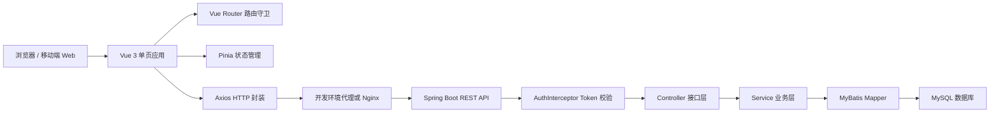
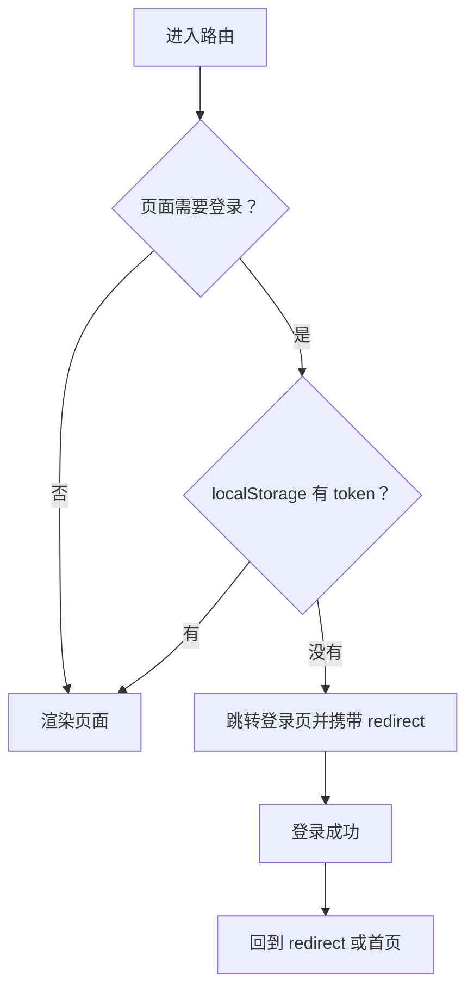
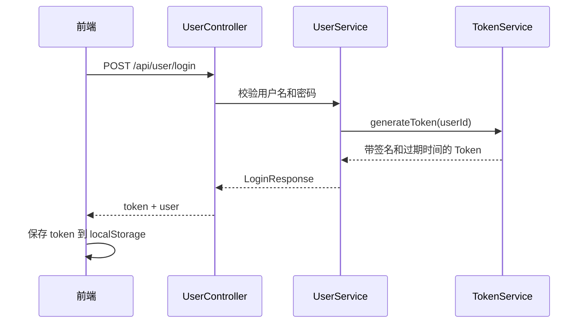
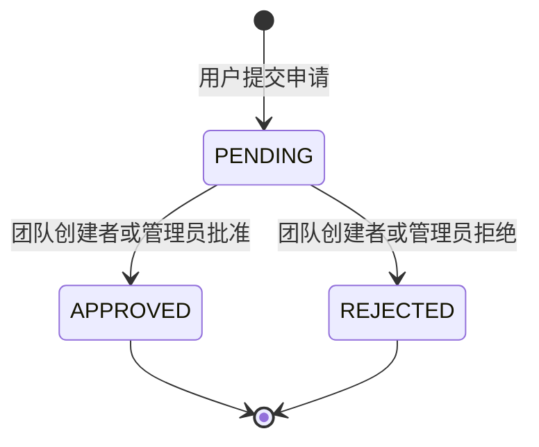
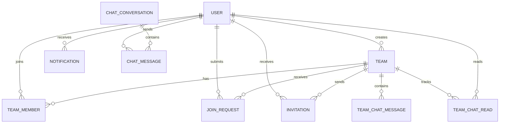
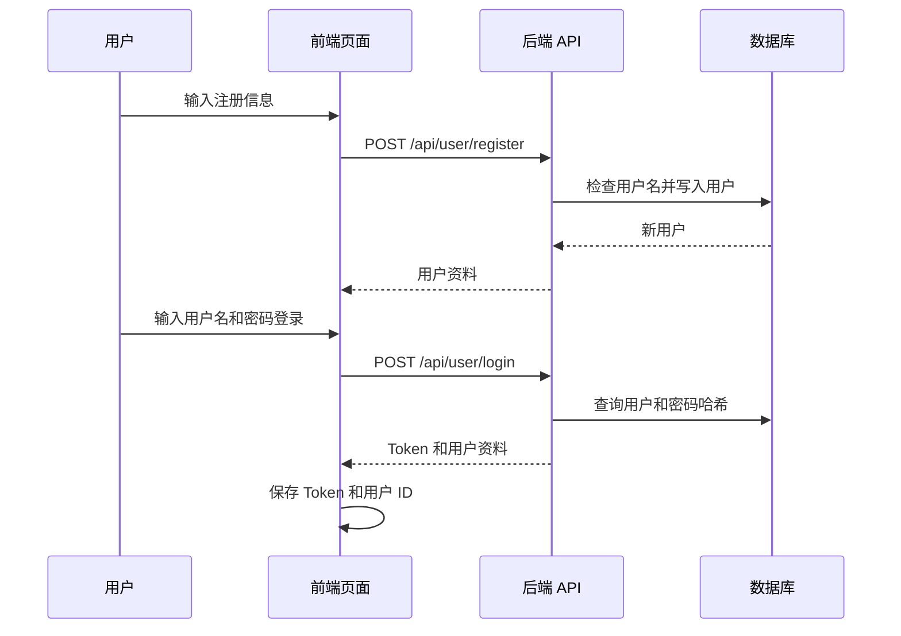
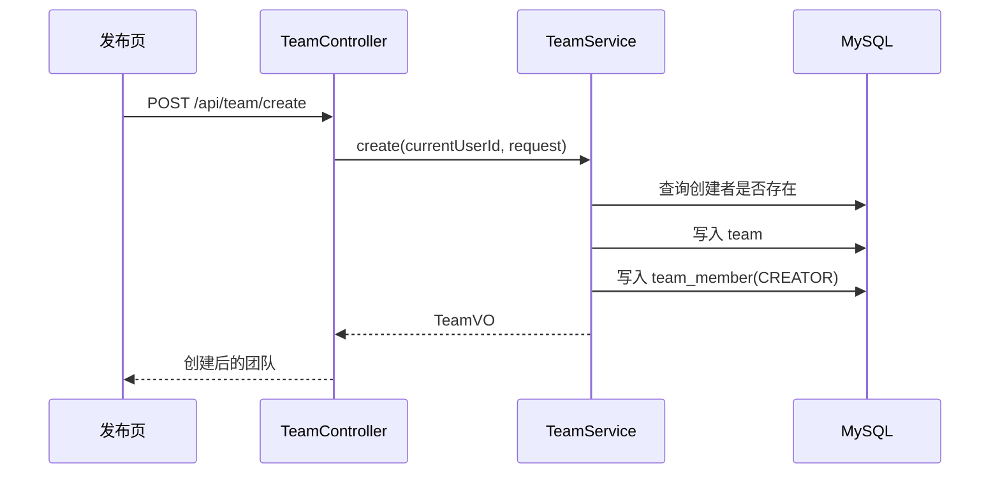
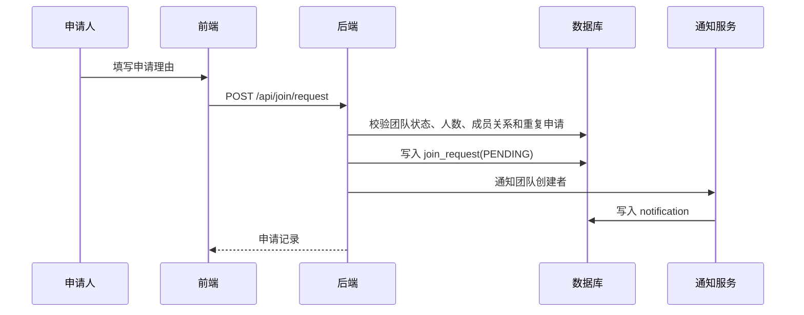
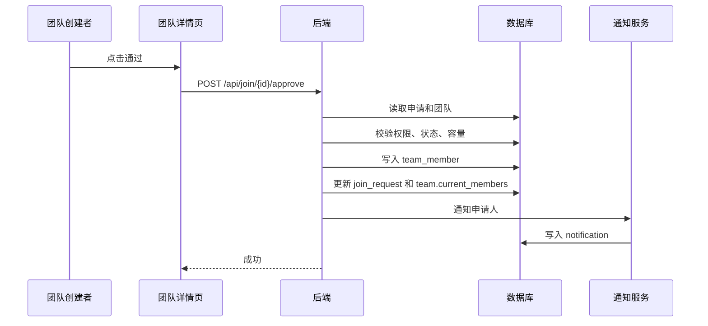
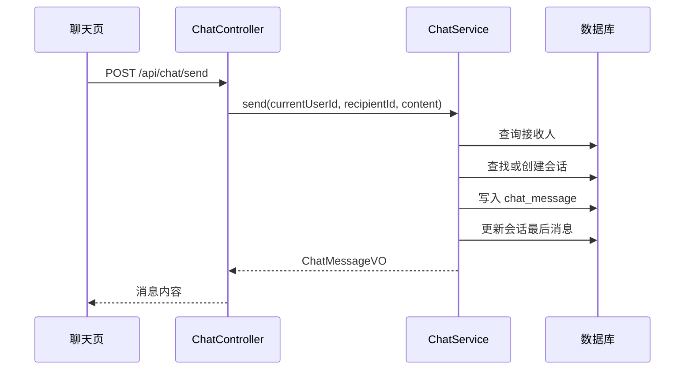

# 校园组队平台开发文档

## 1. 文档说明

本文档依据当前仓库代码、配置文件、数据库脚本和测试用例整理，描述的是已经实现并能从代码中核验的内容。早期文档中与当前代码不一致的内容不作为项目现状。

当前项目是一个面向校园场景的组队平台，主要解决学生发布组队需求、浏览队伍、申请加入、管理队伍、接收通知以及进行私聊和团队聊天的问题。项目采用前后端分离方式实现，前端负责移动端 Web 交互，后端提供 REST API 和业务校验，MySQL 负责持久化存储。

本文档对应的主要代码目录如下：

| 范围 | 目录或文件 | 说明 |
| --- | --- | --- |
| 前端应用 | `frontend/` | Vue 3、Vite、Pinia、Vue Router、Axios、Vant |
| 后端应用 | `backend/teamplatform/` | Spring Boot 3、Java 17、MyBatis、MySQL |
| 数据库结构 | `backend/teamplatform/src/main/resources/schema.sql` | 建表语句和索引 |
| 开发编排 | `compose.yaml` | 本地 Docker Compose 开发环境 |
| 生产编排 | `compose.prod.yaml` | 生产部署编排 |
| 自动化流程 | `.github/workflows/` | CI、覆盖率、镜像构建、安全扫描 |
| 接口文档 | `docs/api.md`、`docs/api.yaml` | 已整理的 API 说明 |

## 2. 项目目标与功能边界

### 2.1 项目目标

平台围绕“校园组队”展开。用户注册并登录后，可以创建自己的团队，也可以浏览别人发布的团队，查看详情和成员列表，再根据团队开放状态提交加入申请。团队创建者可以维护团队基本信息、关闭或开启招募、查看申请记录并进行审批。平台还实现了通知、私聊、团队聊天等配套能力，使组队过程不只停留在信息发布，也能完成后续沟通和处理。

### 2.2 功能介绍

当前代码中已经实现的功能包括：

| 功能域 | 已实现内容 | 主要前端页面 | 主要后端模块 |
| --- | --- | --- | --- |
| 用户认证 | 注册、登录、Token 保存、登录态路由拦截、个人资料读取和修改 | `LoginView.vue`、`RegisterView.vue`、`ProfileView.vue` | `UserController`、`UserServiceImpl`、`AuthInterceptor`、`TokenService` |
| 团队浏览 | 团队列表、关键词筛选、标签筛选、只看可加入团队、团队详情、成员列表 | `HomeView.vue`、`TeamDetailView.vue` | `TeamController`、`TeamServiceImpl` |
| 团队发布与管理 | 创建团队、编辑团队、关闭/开启团队、删除团队、移除成员 | `PublishView.vue`、`TeamDetailView.vue`、`TeamView.vue` | `TeamController`、`TeamServiceImpl` |
| 加入申请 | 提交申请、查看个人申请记录、团队创建者查看申请、审批或拒绝申请 | `ApplyView.vue`、`ProfileView.vue`、`TeamDetailView.vue` | `JoinRequestController`、`JoinRequestServiceImpl` |
| 团队邀请 | 后端已提供发送邀请、查看邀请、接受邀请、拒绝邀请接口 | 接口能力 | `InvitationController`、`InvitationServiceImpl` |
| 通知 | 通知列表、标记已读、删除通知、按相关团队跳转 | `EmailView.vue` | `NotificationController`、`NotificationServiceImpl` |
| 私聊 | 会话列表、消息分页读取、发送消息、标记已读 | `EmailView.vue`、`ChatDetailView.vue` | `ChatController`、`ChatServiceImpl` |
| 团队聊天 | 团队会话列表、团队消息分页读取、发送团队消息、标记已读 | `EmailView.vue`、`ChatDetailView.vue` | `TeamChatController`、`TeamChatServiceImpl` |
| 健康检查与监控 | `/api/health`、Spring Actuator、Prometheus 指标暴露 | 无单独页面 | `HealthController`、`application.properties` |
| 自动化验证 | 前端单元测试/组件测试、后端控制器和服务测试、覆盖率统计、CI | 无单独页面 | `.github/workflows/`、测试目录 |

## 3. 总体架构

### 3.1 架构分层

负责人：郑嘉玮

系统采用前后端分离架构。浏览器运行 Vue 单页应用，页面通过 Axios 访问后端 REST API。后端由 Spring Boot 提供接口，Controller 接收请求并读取当前用户，Service 处理业务规则和事务，Mapper 使用 MyBatis 注解 SQL 访问 MySQL。接口响应统一使用 `Result` 包装，异常由全局异常处理器转换为统一格式。




前端和后端之间约定 `/api` 为接口前缀。前端 `http.ts` 把 Axios 的 `baseURL` 设置为 `/api`，所以 `http.get('/team/list')` 实际访问的是 `/api/team/list`。开发环境下，本地使用 Vite 开发，代理配置把 `/api` 请求转发到后端服务。

「流程图由 AI 辅助生成，经人工审核无误」

### 3.2 后端分层说明

负责人：郑嘉玮

后端代码位于 `backend/teamplatform/src/main/java/com/zjgsu/teamplatform`，包结构清晰，按职责分层：

| 包 | 职责 |
| --- | --- |
| `controller` | 暴露 REST API，处理路径参数、请求体和当前用户 ID |
| `service` | 定义业务接口 |
| `service.impl` | 实现业务规则、权限判断、事务处理和实体转换 |
| `mapper` | 通过 MyBatis 注解 SQL 完成数据库读写 |
| `entity` | 与数据库表对应的实体对象 |
| `dto` | 接收前端请求的数据对象，包含校验注解 |
| `vo` | 返回给前端的视图对象，避免直接暴露数据库实体 |
| `security` | Token 签发、解析和请求拦截 |
| `exception` | 业务异常和全局异常处理 |
| `config` | Web 配置、跨域配置、数据库字段补齐 |
| `common` | 统一响应、错误码、常量 |

### 3.3 前端分层说明

负责人：肖云志，郑嘉玮

前端代码位于 `frontend/src`。

| 目录或文件 | 职责 |
| --- | --- |
| `main.ts` | 创建 Vue 应用，注册 Pinia、Router、Vant |
| `App.vue` | 页面容器和底部导航栏 |
| `router/index.ts` | 路由表和登录态守卫 |
| `api/` | 后端接口封装，按用户、团队、申请、聊天、通知拆分 |
| `stores/user.ts` | 登录态、Token、用户资料加载与保存 |
| `stores/chat.ts` | 私聊/团队聊天列表、消息缓存、已读状态 |
| `views/` | 页面视图，承载主要交互逻辑 |
| `style.css` | 全局样式变量、移动端容器和公共样式 |

前端页面以移动端 Web 体验为主，`App.vue` 将页面宽度限制在配置的最大宽度内，并在底部提供“广场、发布、通知、我的”四个入口。登录页和注册页不显示底部导航，其余页面根据路由显示。

## 4. 技术选型

### 4.1 前端技术

负责人：肖云志

| 技术 | 当前版本范围 | 用途 |
| --- | --- | --- |
| Vue | 3.5.x | 页面和组件开发 |
| Vite | 8.x | 开发服务器和构建 |
| TypeScript | 5.9.x | 前端类型约束 |
| Vue Router | 5.x | 单页应用路由和登录态拦截 |
| Pinia | 3.x | 用户状态和聊天状态管理 |
| Axios | 1.x | HTTP 请求封装 |
| Vant | 4.x | 移动端 UI 组件 |
| Vitest | 4.x | 前端测试和覆盖率 |
| ESLint | 10.x | 前端代码检查 |

### 4.2 后端技术

负责人：郑嘉玮

| 技术 | 当前版本范围 | 用途 |
| --- | --- | --- |
| Java | 17 | 后端开发语言 |
| Spring Boot | 3.5.x | Web 服务、配置和测试基础 |
| Spring Validation | 随 Spring Boot | 请求参数校验 |
| Spring Actuator | 随 Spring Boot | 健康检查和指标暴露 |
| MyBatis Spring Boot Starter | 3.0.x | 数据库访问 |
| MySQL Connector/J | 运行时依赖 | 连接 MySQL |
| Lombok | 1.18.x | 减少实体、DTO、VO 样板代码 |
| Spring Security Crypto | 随依赖 | BCrypt 密码哈希 |

### 4.3 工程化与部署技术

负责人：郑嘉玮

| 技术 | 用途 |
| --- | --- |
| Docker Compose | 本地同时启动前端、后端、MySQL |
| Nginx | 生产前端静态资源服务和接口代理 |
| GitHub Actions | 运行后端测试、前端 lint、前端测试 |
| Codecov | 上传前后端覆盖率 |
| Gitleaks | 扫描敏感信息 |
| Trivy | 扫描后端镜像高危漏洞 |

## 5. 前端实现说明

### 5.1 路由与访问控制

负责人：肖云志、郑嘉玮

前端路由集中在 `frontend/src/router/index.ts`。系统主要页面包括首页、发布页、团队页、团队详情页、申请页、通知页、聊天详情页、登录页、注册页和个人中心。

路由守卫以 `meta.requiresAuth` 判断是否需要登录。需要登录的页面在进入前检查 `localStorage` 中是否存在 `token`。没有 Token 时，路由会跳转到登录页，并把原目标地址放入 `redirect` 查询参数。登录成功后，登录页会优先跳回原目标地址，否则回到首页。

认证过期的处理也放在路由层和 HTTP 层之间协作。Axios 响应拦截器发现接口返回业务码 401 或 HTTP 401 时，会清除本地登录态并发出 `auth-expired` 事件；路由监听到事件后跳转到登录页。



「流程图由 AI 辅助生成，经人工审核修改」

### 5.2 HTTP 请求封装

负责人：郑嘉玮

`frontend/src/api/http.ts` 创建了统一 Axios 实例。所有 API 文件都复用该实例，避免每个页面重复处理请求地址、请求头和错误处理。

请求发出前，如果本地存在 Token，会自动加上 `Authorization: Bearer <token>`。响应返回后，封装层会识别后端统一响应结构：当 `code` 为 200 时直接取 `data` 返回给调用方；当 `code` 不是 200 时抛出错误。这样页面代码只需要关注成功数据和失败提示，不需要在每个页面重复解析响应外层结构。

当前实现中的核心逻辑可以概括为：

```text
请求前：读取 localStorage.token -> 写入 Authorization
响应后：如果 code = 200 -> 返回 data
响应后：如果 code = 401 -> 清理登录态并跳转登录
响应后：其他错误 -> 抛出 message
```

### 5.3 用户状态管理

负责人：郑嘉玮

`stores/user.ts` 保存用户登录态。它维护 `userId`、`token`、`user` 和 `loading`，并提供登录、注册、加载个人资料、保存个人资料、退出登录等方法。

登录成功后，前端会把用户 ID 和 Token 写入 `localStorage`，确保刷新页面后仍能恢复登录态。`loadProfile` 会在有 Token 的情况下调用后端资料接口，如果资料接口失败，则执行退出逻辑，避免前端继续保留失效登录态。

个人资料编辑在 `ProfileView.vue` 中完成。页面会把昵称、邮箱、头像、专业、年级、技能、简介提交给 `updateProfile` 接口。后端只更新请求中不为 `null` 的字段，因此前端可以只传用户实际编辑后的字段。

### 5.4 团队广场与筛选

负责人：郑嘉玮

首页 `HomeView.vue` 是团队广场。页面通过 `getTeamList` 拉取团队列表，并支持关键词、标签和“只看可加入”的筛选条件。关键词输入使用定时器做了简单防抖，避免用户每输入一个字符都立即请求接口。

首页当前内置的标签选项为“前端、后端、娱乐”。标签只是筛选条件，最终仍以数据库中团队的 `tag` 字段为准。点击团队卡片后，页面进入团队详情页。

后端团队列表接口支持三个参数：

| 参数 | 说明 |
| --- | --- |
| `keyword` | 按团队名称或描述模糊搜索 |
| `tag` | 按团队标签过滤 |
| `availableOnly` | 为 true 时只返回状态为 ACTIVE 且人数未满的团队 |

### 5.5 团队发布与草稿

负责人：肖云志，郑嘉玮

发布页 `PublishView.vue` 用于创建团队。表单字段包括团队名称、描述、标签和人数上限。前端对团队名称和人数上限做了基础校验：名称至少 2 个字符，人数上限在 2 到 200 之间。后端还会再次校验名称不能为空、字段长度不超过数据库允许范围、人数上限至少为 1。

发布页实现了本地草稿能力。用户输入的内容会保存到 `localStorage` 的 `publishTeamDraft`。提交成功后，页面删除草稿并跳转回首页。该功能只保存表单文本，不涉及图片或附件。

### 5.6 团队详情与管理

负责人：肖云志、郑嘉玮

团队详情页 `TeamDetailView.vue` 承担普通查看和团队创建者管理两类职责。所有用户都可以查看团队基本信息和成员列表；当前登录用户如果是团队创建者，则页面展示编辑、关闭/开启招募、删除团队、查看申请、审批申请、移除成员等管理操作。

后端的管理权限判断比前端更严格。`TeamServiceImpl`、`JoinRequestServiceImpl`、`InvitationServiceImpl` 均会检查操作者是否为团队创建者或管理员角色。当前页面只把创建者识别为管理员入口，但后端常量中保留了 `ADMIN` 角色判断。

团队详情页中的主要操作与后端行为如下：

| 操作 | 前端入口 | 后端行为 |
| --- | --- | --- |
| 查看详情 | 页面加载 | 根据团队 ID 查询团队 |
| 查看成员 | 成员弹层 | 查询 `team_member`，再补充用户昵称、头像、邮箱等信息 |
| 编辑团队 | 编辑弹层 | 更新名称、描述、标签、人数上限、状态 |
| 关闭/开启招募 | 状态按钮 | 在 ACTIVE 和 CLOSED 之间切换 |
| 删除团队 | 删除按钮 | 仅创建者可删除，先删成员关系再删团队 |
| 移除成员 | 成员列表 | 管理员可移除成员，但不能移除团队创建者 |
| 审批申请 | 申请列表 | 通过后写入团队成员、更新人数、推送通知 |
| 拒绝申请 | 申请列表 | 更新申请状态并推送通知 |

### 5.7 通知与消息中心

负责人：郑嘉玮

通知页 `EmailView.vue` 使用两个页签承载“通知”和“聊天”。通知页签从 `/api/notification/list` 读取当前用户通知，可以标记已读和删除。通知如果带有 `relatedId`，页面会在用户点击后跳转到对应团队详情。

聊天页签同时展示私聊会话和团队聊天会话。会话数据由 `stores/chat.ts` 管理，页面加载时分别调用私聊列表接口和团队聊天列表接口。未读数由后端根据消息已读状态或团队聊天已读时间计算后返回，前端只做展示和本地清零。

### 5.8 聊天页面

负责人：郑嘉玮

`ChatDetailView.vue` 同时处理私聊和团队聊天。路由参数 `type` 决定聊天类型：`user` 表示私聊，`team` 表示团队聊天。页面进入时加载消息，并调用对应已读接口。

当前聊天页面使用定时轮询刷新消息。页面挂载后会建立轮询，定期重新拉取消息；页面卸载时清理定时器。发送消息后，页面将输入框清空并重新加载当前会话消息。为了保持阅读体验，页面会判断用户是否接近底部，只有在合适时自动滚动到底部。

## 6. 后端实现说明

### 6.1 统一响应与异常处理

负责人：郑嘉玮

后端接口统一返回 `Result<T>`，结构包含 `code`、`message`、`data`。成功时 `code` 为 200，失败时由 `ErrorCode` 提供错误码。业务层主动抛出的 `BizException` 会被 `GlobalExceptionHandler` 捕获并转换为统一响应。

全局异常处理覆盖了业务异常、参数校验异常、请求体反序列化异常和未捕获异常。这样前端不需要根据不同异常类型解析多种响应格式。

| 场景 | 后端处理 |
| --- | --- |
| 业务错误 | 抛出 `BizException`，返回对应业务码和消息 |
| 参数校验失败 | 捕获 validation 异常，返回 BAD_REQUEST |
| 请求体格式错误 | 捕获 `HttpMessageNotReadableException`，返回 BAD_REQUEST |
| 未预期异常 | 捕获 `Exception`，返回 INTERNAL_ERROR |

### 6.2 认证与 Token

负责人：郑嘉玮

后端没有引入完整 Spring Security 登录链路，而是实现了轻量 Token 机制。用户登录成功后，`TokenService` 用用户 ID 和过期时间拼成载荷，再使用 HmacSHA256 生成签名。Token 形态由两部分组成：Base64URL 编码后的载荷和签名，中间用点号连接。

Token 默认有效期为 7 天。服务端解析 Token 时，会检查格式、签名、过期时间，再取出用户 ID。解析成功后，`AuthInterceptor` 把用户 ID 写入请求属性 `currentUserId`，Controller 再从请求属性中读取当前用户。



公开接口由 `AuthInterceptor` 放行，包括注册、登录、健康检查、团队列表、团队详情、团队成员列表。其他 `/api/**` 接口必须携带 Bearer Token。OPTIONS 请求也会放行，便于跨域预检。

「流程图由 AI 辅助生成，经人工审核修改」

### 6.3 用户模块

负责人：郑嘉玮

用户模块包含注册、登录、查看个人资料和更新个人资料。

注册时，后端先按用户名查询是否已存在；不存在时使用 BCrypt 对密码加密，再写入用户表。返回给前端的是 `UserVO`，不包含密码字段。登录时，后端通过 BCrypt 校验明文密码和数据库哈希值，校验通过后签发 Token。

个人资料更新采用“空字段不覆盖”的策略。请求体中如果某个字段为 `null`，后端保持数据库原值；如果字段不为 `null`，才更新到用户实体。这样可以支持局部更新，不要求前端每次提交完整资料。

### 6.4 团队模块

负责人：郑嘉玮

团队模块是系统核心。团队创建时，后端会同时写入 `team` 和 `team_member` 两张表。创建者被自动加入团队，角色为 `CREATOR`，团队当前人数初始化为 1。该过程使用事务包裹，避免出现团队创建成功但成员关系未写入的半完成状态。

团队列表通过 MyBatis 动态 SQL 根据筛选条件查询。关键词会作用于团队名称和描述，标签会按精确值过滤，可加入条件会限制状态为 `ACTIVE` 且当前人数小于人数上限。

团队编辑时，后端会校验操作者权限。创建者或管理员可以更新团队名称、描述、标签、人数上限和状态。人数上限不能小于当前成员数，否则会破坏成员数据的一致性。

团队删除只允许创建者执行。删除时先删除团队成员关系，再删除团队记录。当前数据库中加入申请、邀请、聊天等表存在团队外键，因此如果团队已经有关联记录，数据库约束可能阻止删除；这是当前实现需要使用者注意的边界。

### 6.5 加入申请模块

负责人：郑嘉玮

加入申请用于处理“用户主动申请加入团队”的流程。申请创建前，后端会依次检查团队是否存在、团队是否处于 ACTIVE、团队是否满员、申请人是否已经在团队中、是否已有待处理申请。通过检查后写入 `join_request`，状态为 `PENDING`，并给团队创建者推送一条通知。

审批申请时，后端再次检查申请状态、团队状态、申请人是否已入队、团队是否满员。审批通过后，会把申请人写入 `team_member`，更新申请状态为 `APPROVED`，同步团队当前人数，并通知申请人。拒绝申请则只更新申请状态为 `REJECTED`，并通知申请人。



审批通过的核心规则可以用简短伪代码表示：

```text
读取申请和团队
校验操作者是创建者或管理员
校验申请状态仍为 PENDING
校验团队仍开放且未满员
校验申请人尚未在团队中
写入 team_member
更新 join_request.status = APPROVED
更新 team.current_members
推送通知给申请人
```

「伪代码由 AI 总结并生成，经人工审核修改」

### 6.6 邀请模块

负责人：郑嘉玮

邀请模块用于处理“团队方向用户发出邀请”的流程。后端已经提供接口和业务实现。发送邀请时，操作者必须是团队创建者或管理员；被邀请用户不能已经在团队中，也不能已经存在同一团队的待处理邀请。邀请写入后，会给被邀请用户推送通知。

用户接受邀请时，后端会确认该邀请属于当前用户，且状态仍为 `PENDING`。然后检查团队容量和成员关系，写入 `team_member`，更新邀请状态为 `ACCEPTED`，同步团队当前人数，并通知邀请发起人。拒绝邀请则更新状态为 `REJECTED`，并通知邀请发起人。

邀请模块的实现集中在后端接口和业务服务中，可完成邀请发送、邀请列表查询、接受邀请和拒绝邀请的状态流转。

### 6.7 通知模块

负责人：郑嘉玮

通知模块是其他业务流程的辅助模块。通知表保存接收人、消息内容、类型、关联 ID、已读状态和创建时间。加入申请创建、申请审批、邀请处理等流程都会调用 `NotificationService.push` 写入通知。

通知接口支持三类操作：查看当前用户通知、标记自己的通知已读、删除自己的通知。标记已读和删除时都会带上当前用户 ID 作为条件，避免用户操作别人的通知。

### 6.8 私聊模块

负责人：郑嘉玮

私聊由 `chat_conversation` 和 `chat_message` 两张表支撑。会话表保存两个用户、最后一条消息和最后消息时间；消息表保存会话 ID、发送方、接收方、内容、已读状态和创建时间。

系统为了避免同一对用户出现两条会话，创建会话时按用户 ID 大小固定顺序保存 `user1_id` 和 `user2_id`。例如用户 3 和用户 9 的会话总是保存为 `user1_id=3,user2_id=9`。数据库表上也有 `(user1_id,user2_id)` 唯一约束，进一步防止重复会话。

私聊消息列表接口支持分页。后端按创建时间倒序查询最新消息，再在返回前反转列表，使前端拿到的消息按时间正序展示。未读数通过统计“对方发给我且未读”的消息数量得到。标记已读时，后端把指定对方发送给当前用户的未读消息统一置为已读。

### 6.9 团队聊天模块

负责人：郑嘉玮

团队聊天由 `team_chat_message` 和 `team_chat_read` 两张表支撑。消息表记录团队 ID、发送人、内容和创建时间；已读表记录某个用户在某个团队最后一次阅读到的时间。

团队聊天和私聊不同，没有为每个用户保存每条消息的已读状态，而是保存“最后阅读时间”。查询未读数时，后端统计团队中在该时间之后、且不是当前用户自己发送的消息数量。发送团队消息后，后端会把发送人的已读时间更新为当前时间，避免自己发送的消息被计入自己的未读。

团队聊天接口全部要求当前用户是该团队成员。非团队成员无法读取团队消息、发送团队消息或标记已读。


## 7. 数据库设计

### 7.1 表结构概览

负责人：郑嘉玮

当前数据库共有 10 张核心业务表：

| 表名 | 作用 |
| --- | --- |
| `user` | 用户账号、密码哈希、邮箱和个人资料 |
| `team` | 团队基本信息、创建者、人数和状态 |
| `team_member` | 团队成员关系和角色 |
| `join_request` | 用户主动加入团队的申请 |
| `invitation` | 团队向用户发出的邀请 |
| `notification` | 站内通知 |
| `chat_conversation` | 私聊会话 |
| `chat_message` | 私聊消息 |
| `team_chat_message` | 团队聊天消息 |
| `team_chat_read` | 团队聊天已读时间 |

### 7.2 关系示意

负责人：郑嘉玮



「关系图由 AI 生成，经人工审核无误」

### 7.3 关键字段说明

负责人：郑嘉玮

| 表 | 关键字段 | 说明 |
| --- | --- | --- |
| `user` | `username`、`email` | 均有唯一约束，避免重复账号和重复邮箱 |
| `user` | `password` | 保存 BCrypt 哈希，不保存明文密码 |
| `team` | `creator_id` | 指向团队创建者 |
| `team` | `max_members`、`current_members` | 分别记录人数上限和当前人数 |
| `team` | `status` | 当前使用 `ACTIVE`、`CLOSED` 两类状态 |
| `team_member` | `(team_id,user_id)` | 唯一约束，避免同一用户重复入队 |
| `team_member` | `role` | 当前使用 `CREATOR`、`MEMBER`，后端也识别 `ADMIN` |
| `join_request` | `(team_id,user_id)` | 唯一约束，避免同一用户对同一团队重复建多条申请记录 |
| `join_request` | `status` | `PENDING`、`APPROVED`、`REJECTED` |
| `invitation` | `status` | `PENDING`、`ACCEPTED`、`REJECTED` |
| `notification` | `related_id` | 用于关联团队等业务对象，前端可据此跳转 |
| `chat_conversation` | `(user1_id,user2_id)` | 唯一约束，保证两人只有一个会话 |
| `chat_message` | `is_read` | 私聊消息已读状态 |
| `team_chat_read` | `(team_id,user_id)` | 唯一约束，每个用户在每个团队只有一条已读记录 |

### 7.4 索引设计

负责人：郑嘉玮

`schema.sql` 为常用查询建立了索引。团队成员按团队和用户查询，加入申请按团队和用户查询，邀请按团队和用户查询，通知按用户查询，聊天消息按会话和接收方查询，团队聊天按团队和创建时间查询。这些索引与当前业务访问路径一致，主要服务列表页、详情页、消息页和通知页。

## 8. API 设计

### 8.1 接口风格

负责人：郑嘉玮

后端接口使用 JSON 格式，统一前缀为 `/api`。除注册、登录、健康检查、团队公开查询接口外，其余接口都需要在请求头携带 Bearer Token。

统一响应格式如下：

| 字段 | 说明 |
| --- | --- |
| `code` | 业务状态码，成功为 200 |
| `message` | 成功或失败消息 |
| `data` | 业务数据，失败时通常为空 |

### 8.2 用户接口

负责人：郑嘉玮

| 方法 | 路径 | 说明 | 是否需要登录 |
| --- | --- | --- | --- |
| POST | `/api/user/register` | 用户注册 | 否 |
| POST | `/api/user/login` | 用户登录并返回 Token | 否 |
| GET | `/api/user/profile` | 获取当前用户资料 | 是 |
| PUT | `/api/user/profile` | 更新当前用户资料 | 是 |

### 8.3 团队接口

负责人：郑嘉玮

| 方法 | 路径 | 说明 | 是否需要登录 |
| --- | --- | --- | --- |
| POST | `/api/team/create` | 创建团队 | 是 |
| GET | `/api/team/list` | 查询团队列表，支持筛选 | 否 |
| GET | `/api/team/{id}` | 查询团队详情 | 否 |
| GET | `/api/team/my` | 查询我创建的团队 | 是 |
| PUT | `/api/team/{id}` | 更新团队信息 | 是 |
| DELETE | `/api/team/{id}` | 删除团队 | 是 |
| GET | `/api/team/{id}/members` | 查询团队成员 | 否 |
| POST | `/api/team/{id}/members` | 添加团队成员 | 是 |
| DELETE | `/api/team/{id}/members/{userId}` | 移除团队成员 | 是 |

### 8.4 加入申请接口

负责人：郑嘉玮

| 方法 | 路径 | 说明 | 是否需要登录 |
| --- | --- | --- | --- |
| POST | `/api/join/request` | 提交加入申请 | 是 |
| GET | `/api/join/requests` | 查询我的申请记录 | 是 |
| GET | `/api/team/{id}/join-requests` | 查询团队收到的申请 | 是 |
| POST | `/api/join/{requestId}/approve` | 批准申请 | 是 |
| POST | `/api/join/{requestId}/reject` | 拒绝申请 | 是 |

### 8.5 邀请接口

负责人：郑嘉玮

| 方法 | 路径 | 说明 | 是否需要登录 |
| --- | --- | --- | --- |
| POST | `/api/invitation/send` | 发送团队邀请 | 是 |
| GET | `/api/invitation/list` | 查询我的邀请 | 是 |
| GET | `/api/team/{id}/invitations` | 查询团队邀请记录 | 是 |
| POST | `/api/invitation/{id}/accept` | 接受邀请 | 是 |
| POST | `/api/invitation/{id}/reject` | 拒绝邀请 | 是 |

### 8.6 通知接口

负责人：郑嘉玮

| 方法 | 路径 | 说明 | 是否需要登录 |
| --- | --- | --- | --- |
| GET | `/api/notification/list` | 查询通知列表 | 是 |
| POST | `/api/notification/{id}/read` | 标记通知已读 | 是 |
| DELETE | `/api/notification/{id}` | 删除通知 | 是 |

### 8.7 私聊接口

负责人：郑嘉玮

| 方法 | 路径 | 说明 | 是否需要登录 |
| --- | --- | --- | --- |
| GET | `/api/chat/list` | 查询私聊会话列表 | 是 |
| GET | `/api/chat/conversation/{otherUserId}` | 查询与某个用户的消息 | 是 |
| POST | `/api/chat/send` | 发送私聊消息 | 是 |
| POST | `/api/chat/conversation/{otherUserId}/read` | 标记与某用户的消息已读 | 是 |

### 8.8 团队聊天接口

负责人：郑嘉玮

| 方法 | 路径 | 说明 | 是否需要登录 |
| --- | --- | --- | --- |
| GET | `/api/team/chat/list` | 查询团队聊天会话列表 | 是 |
| GET | `/api/team/chat/{teamId}/messages` | 查询团队聊天消息 | 是 |
| POST | `/api/team/chat/{teamId}/send` | 发送团队聊天消息 | 是 |
| POST | `/api/team/chat/{teamId}/read` | 标记团队聊天已读 | 是 |

### 8.9 健康检查接口

负责人：郑嘉玮

| 方法 | 路径 | 说明 | 是否需要登录 |
| --- | --- | --- | --- |
| GET | `/api/health` | 返回应用状态、时间戳和版本 | 否 |
| GET | `/actuator/prometheus` | 暴露 Prometheus 指标 | 否 |

## 9. 核心业务流程

### 9.1 注册登录流程

负责人：肖云志、郑嘉玮



注册时后端要求用户名、昵称、密码、邮箱都不能为空。密码长度限制为 6 到 50，邮箱必须符合邮箱格式。登录成功后，前端不保存密码，只保存 Token、用户 ID 和接口返回的用户资料。

### 9.2 创建团队流程

负责人：郑嘉玮



创建团队时，后端默认人数上限为 10，当前人数为 1，状态为 `ACTIVE`。创建者会自动成为团队成员。整个过程在事务中执行。

### 9.3 申请加入流程

负责人：郑嘉玮



申请加入不是直接入队，而是先进入待处理状态。只有团队创建者或管理员审批通过后，申请人才会被写入团队成员表。

### 9.4 审批申请流程

负责人：郑嘉玮



审批流程的重点在于重复校验。即使前端已经展示了团队未满、申请未处理，后端仍会在最终写入前重新检查，避免并发或旧页面状态导致数据不一致。

### 9.5 私聊流程

负责人：郑嘉玮



系统使用固定顺序保存会话双方，避免 A-B 和 B-A 生成两条会话。读取消息时按分页查询，再返回时间正序列表。页面当前通过轮询刷新消息。

「以上流程图结构由AI辅助生成，经人工审核修改」

### 9.6 团队聊天流程

负责人：郑嘉玮

团队聊天要求用户必须是团队成员。读取团队聊天列表时，后端先查询当前用户加入的团队，再为每个团队查最后一条消息和未读数量。未读数量不是逐条保存，而是通过 `team_chat_read.last_read_at` 与消息创建时间比较得到。

```text
团队未读数 = 当前团队中 created_at > last_read_at 且 sender_id != 当前用户 的消息数量
```

如果用户从未读过该团队消息，`last_read_at` 为空，则统计该团队中除自己发送外的所有消息。

## 10. 安全设计

负责人：郑嘉玮

### 10.1 已实现的安全措施

负责人：郑嘉玮

当前代码中已经落地的安全措施包括：

| 措施 | 说明 |
| --- | --- |
| 密码哈希 | 注册时使用 BCrypt 保存密码哈希 |
| Bearer Token | 登录后签发带过期时间和 HMAC 签名的 Token |
| 请求拦截 | 受保护接口由 `AuthInterceptor` 统一校验 Token |
| 当前用户可信来源 | 业务接口不从前端传用户 ID 判断身份，而是从 Token 解析结果取当前用户 |
| 参数校验 | DTO 使用 `@NotBlank`、`@NotNull`、`@Size`、`@Email`、`@Min` |
| 业务权限校验 | 团队管理、申请审批、邀请处理、团队聊天均在 Service 层校验权限 |
| 统一异常格式 | 异常统一包装为 `Result` 返回，前端处理方式一致 |
| 敏感字段隔离 | 用户返回对象使用 `UserVO`，不返回密码字段 |

### 10.2 当前安全边界

负责人：郑嘉玮

后端认证采用项目内部实现的轻量 Token 机制。Token 默认密钥来自配置项 `app.auth.secret`，如果未配置则使用默认值。部署时可通过配置项覆盖默认密钥。

`application.properties` 和 `compose.yaml` 中包含本地开发数据库账号密码。它们用于开发环境连接 MySQL；`compose.yaml` 中后端服务也通过环境变量传入数据源连接信息。

跨域配置当前允许所有来源并允许携带凭证，满足本地前后端分离调试时的接口访问需求。

## 11. 测试与质量保障

### 11.1 后端测试

负责人：郑嘉玮

后端测试位于 `backend/teamplatform/src/test/java`。测试覆盖了用户、团队、加入申请、邀请、私聊、团队聊天、Token 服务以及部分 Controller。

| 测试范围 | 代表文件 | 说明 |
| --- | --- | --- |
| 应用启动 | `TeamplatformApplicationTests.java` | 验证 Spring 上下文可加载 |
| Controller | `UserControllerTest.java`、`TeamControllerTest.java` | 使用 MockMvc 验证接口响应 |
| 用户服务 | `UserServiceImplTest.java` | 验证注册、登录、资料逻辑 |
| 团队服务 | `TeamServiceImplTest.java` | 验证创建、更新、成员管理 |
| 加入申请 | `JoinRequestServiceImplTest.java` | 验证申请、审批、拒绝 |
| 邀请 | `InvitationServiceImplTest.java` | 验证邀请发送和处理 |
| 私聊 | `ChatServiceImplTest.java` | 验证会话、消息和已读 |
| 团队聊天 | `TeamChatServiceImplTest.java` | 验证团队消息和未读统计 |
| Token | `TokenServiceTest.java` | 验证签发、解析和异常 Token |

后端 Maven 配置了 Jacoco。当前覆盖率规则要求 `UserServiceImpl`、`TeamServiceImpl`、`TokenService` 的行覆盖率不低于 60%。

### 11.2 前端测试

负责人：肖云志

前端测试位于 `frontend/src/__tests__`，使用 Vitest 和 Vue Test Utils。测试覆盖基础工具行为、API 封装、HTTP 拦截器、路由守卫、Store 状态和部分页面渲染。

| 测试文件 | 覆盖内容 |
| --- | --- |
| `basic.test.ts` | 基础 JavaScript/TypeScript 行为 |
| `api.test.ts` | API 方法调用路径和参数 |
| `http.test.ts` | Axios 封装、Token 注入、错误处理 |
| `router.test.ts` | 路由存在性和鉴权跳转 |
| `stores.test.ts` | 用户 Store 登录态、资料加载等 |
| `views.test.ts` | 页面组件基础渲染 |

### 11.3 CI 与覆盖率

负责人：肖云志、郑嘉玮

GitHub Actions 中包含以下流程：

| 工作流 | 文件 | 触发 | 当前动作 |
| --- | --- | --- | --- |
| Full Stack CI | `.github/workflows/ci.yml` | push、PR、手动触发 | 后端 Maven test，前端 npm ci、lint、test |
| Coverage | `.github/workflows/coverage.yml` | 前后端路径变化、手动触发 | 后端 Jacoco、前端 Vitest 覆盖率并上传 Codecov |
| Build and Push Docker Image | `.github/workflows/docker.yml` | main 分支 push | 构建后端镜像、推送 GHCR、Trivy 扫描 |
| Security Scan | `.github/workflows/security.yml` | push、PR | Gitleaks 敏感信息扫描 |

## 12. 运行与部署

### 12.1 本地开发运行

负责人：郑嘉玮

本地开发推荐使用 Docker Compose。`compose.yaml` 会启动三个服务：前端、后端和 MySQL。

| 服务 | 镜像 | 端口 | 说明 |
| --- | --- | --- | --- |
| `frontend` | `node:20-alpine` | `5173:5173` | 安装依赖并运行 Vite 开发服务器 |
| `backend` | `maven:3.9-eclipse-temurin-17-alpine` | `8765:8080` | 运行 Spring Boot 开发服务 |
| `db` | `mysql:8.0` | `4306:3306` | 初始化 `teamplatform` 数据库 |

后端容器通过环境变量连接 Compose 中的 MySQL 服务。MySQL 首次初始化时会执行 `schema.sql` 建表。后端健康检查使用 `/api/health`。

常用本地命令如下：

```bash
docker compose up -d
npm run lint --prefix frontend
npm run test --prefix frontend
cd backend/teamplatform && ./mvnw test
```

在 Windows PowerShell 中，后端测试可使用：

```powershell
cd backend\teamplatform
.\mvnw.cmd test
```

### 12.2 前端构建与代理

负责人：郑嘉玮

前端开发环境由 Vite 提供。`frontend/vite.config.ts` 配置了 Vue 插件、Vant 组件自动导入以及开发代理。开发时前端请求 `/api` 会转发到 `http://localhost:8765`。

生产构建后，前端静态文件由 Nginx 提供服务。`frontend/nginx.conf` 中将普通路由回退到 `index.html`，保证 Vue Router 的 history 模式在刷新页面时仍能正常访问；同时把 `/api/` 代理到后端服务。

### 12.3 后端部署

负责人：郑嘉玮

后端 Dockerfile 位于 `backend/teamplatform/Dockerfile`。CI 中的镜像构建流程以该目录为构建上下文，并将镜像推送到 GHCR。生产环境的具体数据库地址、用户名、密码、鉴权密钥等应由部署环境注入。

## 13. 日志与监控

负责人：郑嘉玮

后端启用了 Spring Actuator，配置中暴露了 `health`、`info`、`prometheus`、`metrics`。Prometheus 指标路径为 `/actuator/prometheus`。`management.metrics.tags.application=teamplatform` 用于给指标增加应用标签。

项目还引入了 `logstash-logback-encoder` 并配置了 `logback-spring.xml`。日志配置用于输出结构化日志。当前文档只记录已有依赖和配置，不声明已经接入外部监控平台。

## 14. 代码一致性说明

负责人：郑嘉玮

### 14.1 与代码一致的关键结论

负责人：郑嘉玮

本文档中的功能均可在当前代码中找到对应实现。需要特别说明的几个一致性点如下：

| 结论 | 代码依据 |
| --- | --- |
| 前端采用 Vue 3、Vite、Pinia、Vue Router 和 Axios | `frontend/package.json`、`frontend/src/main.ts` |
| 后端采用 Spring Boot、Java 17、MyBatis 和 MySQL | `backend/teamplatform/pom.xml`、`schema.sql` |
| 团队列表筛选由关键词、标签、可加入条件组成 | `HomeView.vue`、`TeamMapper.java` |
| 聊天页面使用 HTTP 接口定时刷新消息 | `ChatDetailView.vue`、`ChatController`、`TeamChatController` |
| 团队邀请由后端接口和服务处理 | `InvitationController`、`InvitationServiceImpl` |

### 14.2 当前实现约束

负责人：郑嘉玮

当前系统的关键业务约束如下：

| 约束 | 说明 |
| --- | --- |
| 团队创建者自动入队 | 创建团队时同步写入 `team_member`，角色为 `CREATOR` |
| 团队人数上限不能小于当前人数 | 更新团队时由 `TeamServiceImpl` 校验 |
| 加入申请必须处于待处理状态才能审批 | 审批前由 `JoinRequestServiceImpl` 校验 |
| 团队聊天必须是团队成员才能访问 | 读取、发送、标记已读前均校验成员身份 |
| 私聊会话双方按用户 ID 固定顺序保存 | 避免同一对用户产生重复会话 |
| 团队聊天未读数按最后阅读时间计算 | 使用 `team_chat_read.last_read_at` 与消息时间比较 |

## 15. 文档维护记录

负责人：郑嘉玮

本文档基于当前仓库实现整理，章节负责人暂按“待补充”预留。文档中的接口路径、数据表、业务流程和测试命令均来自当前代码和配置文件。
